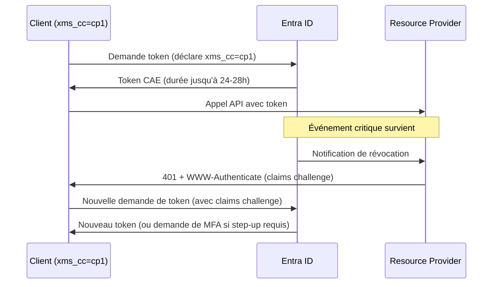

# CAE — Continuous Access Evaluation

Révocation des tokens en **quasi temps réel**, sans attendre leur expiration naturelle.

---

## Le problème que CAE résout

Sans CAE, un access token émis à 09h00 reste valide jusqu'à 10h00, même si :

- le compte utilisateur est désactivé à 09h15
- le mot de passe est changé à 09h20
- une politique de localisation IP est violée

**CAE permet à Entra ID de signaler ces événements aux Resource Providers (Exchange, SharePoint, Teams, Graph) en quelques secondes**, qui rejettent alors immédiatement le token.

---

## Les deux mécanismes

| Mécanisme | Licence requise | Latence |
|---|---|---|
| **Évaluation des événements critiques** | Aucune (Free) | Quasi temps réel (~secondes) |
| **Évaluation des politiques Conditional Access** | Entra ID P1 | Quasi temps réel à ~15 min |

---

## Déclencheurs de révocation

| Événement | Type | Latence |
|---|---|---|
| Désactivation du compte | Critique | Quasi temps réel |
| Changement de mot de passe | Critique | Quasi temps réel |
| Révocation explicite des sessions (admin) | Critique | Quasi temps réel |
| Risque utilisateur élevé (Identity Protection) | Policy CA | ~15 min |
| Changement de localisation réseau (Named Location) | Policy CA | Instantané |
| Token exporté hors réseau de confiance | Policy CA | Instantané |

---

## Flux CAE complet



---

## Le claim `xms_cc`

`xms_cc = "cp1"` signale qu'un client **sait gérer un claims challenge**.

Sans ce claim, le Resource Provider ne peut pas envoyer de challenge — il doit simplement rejeter le token avec un 401 standard, ce qui force une reconnexion complète.

```json
// Claims optionnels à déclarer dans le manifeste de l'App Registration
{
  "optionalClaims": {
    "accessToken": [
      { "name": "xms_cc" }
    ]
  }
}
```

---

## Gestion du claims challenge côté application

```csharp
// Pattern de gestion CAE (C# / MSAL.NET)
try
{
    var response = await httpClient.SendAsync(request);

    if (response.StatusCode == HttpStatusCode.Unauthorized)
    {
        var claimsChallenge = WwwAuthenticateParameters
            .GetClaimChallengeFromResponseHeaders(response.Headers);

        if (claimsChallenge != null)
        {
            // Tentative silencieuse avec le challenge
            var result = await app
                .AcquireTokenSilent(scopes, account)
                .WithClaims(claimsChallenge)
                .ExecuteAsync();
        }
    }
}
catch (MsalUiRequiredException)
{
    // Step-up requis — interaction utilisateur nécessaire
    var result = await app
        .AcquireTokenInteractive(scopes)
        .WithClaims(claimsChallenge)
        .ExecuteAsync();
}
```

---

## Durée de vie des tokens CAE

| Token | Sans CAE | Avec CAE |
|---|---|---|
| Access Token | 1 heure | Jusqu'à 24-28 heures |
| Sécurité compensée par | Expiration fréquente | Révocation événementielle |

!!! info "CAE et Token Protection sont complémentaires"
    **CAE** révoque un token après un événement critique détecté.
    **[Token Protection](token-protection.md)** empêche le rejeu d'un token volé même pendant sa durée de vie normale.
    Les deux ensemble couvrent la quasi-totalité des scénarios d'attaque sur les tokens.

---

## Services CAE-compatibles (juin 2026)

- Exchange Online
- SharePoint Online
- Microsoft Teams
- Microsoft Graph
- Azure Resource Manager (ARM)
