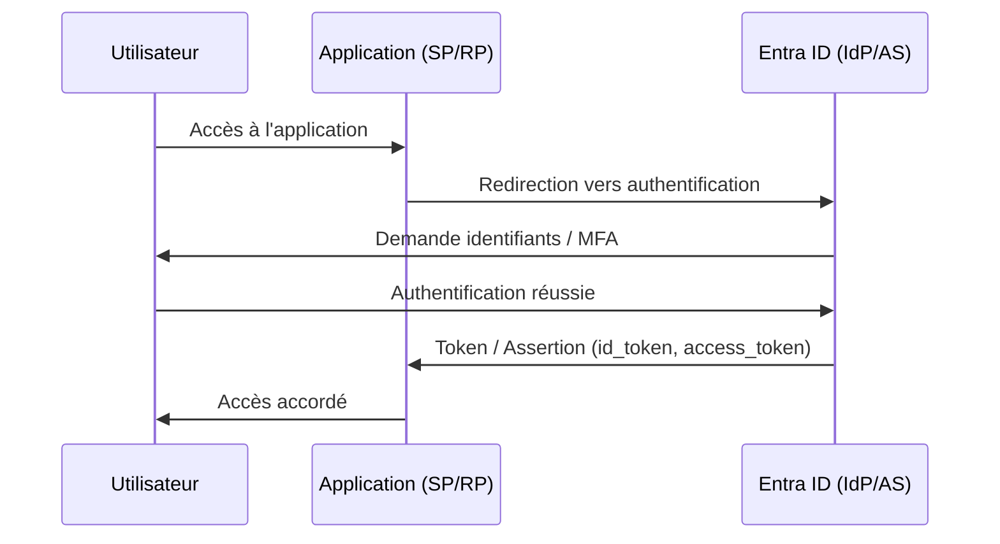
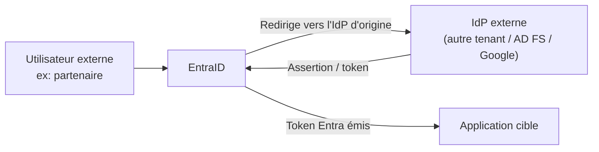

# Définitions essentielles

## IAM — Identity & Access Management

Cadre de politiques et technologies qui garantit que les **bonnes entités** accèdent aux **bonnes ressources**, dans les **bonnes conditions**, au **bon moment**.

| Concept | Définition | Exemple Azure |
|---|---|---|
| **Identité** | Toute entité pouvant s'authentifier | Utilisateur, application, VM |
| **Principal** | Identité avec des permissions assignées | User principal, Service principal |
| **Authentification (AuthN)** | Vérifier *qui tu es* | Login + MFA |
| **Autorisation (AuthZ)** | Vérifier *ce que tu peux faire* | RBAC, CA Policy |
| **Tenant** | Instance isolée d'Entra ID | `dgfla.onmicrosoft.com` |
| **Directory** | Annuaire d'objets (users, groups, apps) | Entra ID directory |

---

## IdP, SP, RP — les rôles dans un flux OAuth2/OIDC

!!! info "Le rôle d'IdP est relatif, pas absolu"
    Entra ID est IdP quand il authentifie ses propres comptes. Il devient SP/RP quand il délègue à un IdP externe (autre tenant, Google, AD FS on-prem).

### Rôles fondamentaux

**IdP — Identity Provider**
: L'entité qui détient et vérifie l'identité. Émet les tokens/assertions.
: *Exemple : Microsoft Entra ID pour les comptes `@dgfla.com`*

**SP — Service Provider** *(terminologie SAML)*
: L'application qui reçoit l'assertion SAML et accorde l'accès.
: *Exemple : une application SaaS (iManage, Yousign) configurée en SSO SAML*

**RP — Relying Party** *(terminologie OIDC/OAuth2)*
: L'application qui consomme l'id_token OIDC ou l'access token OAuth2.
: *Même rôle que SP, vocabulaire différent selon le protocole*

**AS — Authorization Server**
: Le serveur qui émet les access tokens OAuth2.
: *Dans Entra ID : c'est le même endpoint que l'IdP — `login.microsoftonline.com/{tenant}/oauth2/v2.0/token`*

**RS — Resource Server**
: L'API protégée qui valide le token et sert les ressources.
: *Exemple : Microsoft Graph, ton API Azure Functions*

---

## Flux simplifié IdP → SP/RP



---

## Cas où Entra ID est lui-même SP (fédération)



Cas concrets :
- **B2B Collaboration** : utilisateur invité d'un autre tenant Entra ID
- **Hybrid Identity** : authentification déléguée à AD FS on-prem
- **External ID** : connexion via compte Google / Facebook

---

## Hiérarchie des permissions Entra ID

```
Tenant
└── Directory
    ├── Users
    ├── Groups
    ├── Applications (App Registrations)
    │   └── Service Principals (Enterprise Apps)
    └── Managed Identities
```

!!! tip "App Registration vs Enterprise App"
    **App Registration** = la définition de l'application (client ID, secrets, redirect URIs, permissions déclarées) — existe dans **un seul tenant** (le tenant de l'éditeur).

    **Enterprise Application / Service Principal** = la représentation de l'application dans **chaque tenant** où elle est utilisée. C'est sur le SP que s'appliquent les assignations d'utilisateurs et les politiques Conditional Access.
