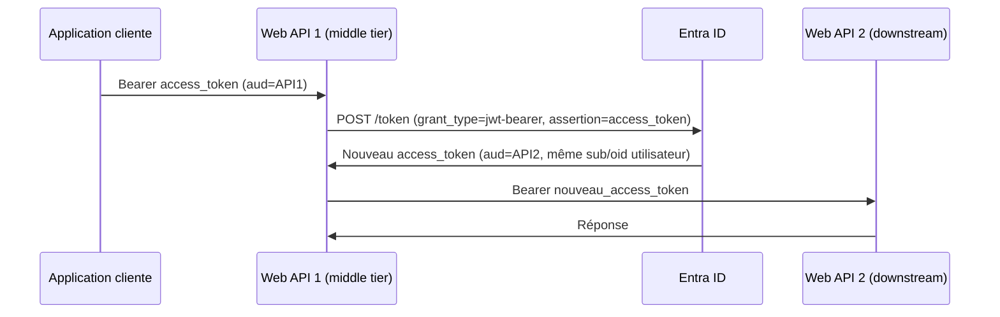

# OBO — On-Behalf-Of Flow

Quand un **Web API doit appeler un autre API** au nom de l'utilisateur qui l'a appelé.

---

## Le problème que OBO résout

```
Application cliente          Web API 1 (middle tier)       Web API 2 (downstream)
     │                              │                              │
     │  access_token (aud=API1)     │                              │
     │─────────────────────────────►│                              │
     │                              │  Besoin d'appeler API 2      │
     │                              │  au nom de l'utilisateur...  │
     │                              │  Mais le token est pour API1 │
```

Sans OBO, API 1 devrait soit utiliser son propre token (perd l'identité utilisateur), soit demander à l'utilisateur de se reconnecter (impossible en background).

---

## Flux OBO



---

## Prérequis

1. **API 1 doit être un client confidentiel** — le flow OBO nécessite un secret ou un certificat
2. **L'utilisateur doit avoir consenti** aux scopes d'API 2 que API 1 va demander
3. **API 2 doit avoir exposé des scopes** accessibles à API 1

```
Portail Entra → API 2 → Expose an API → Add a scope
→ Qui peut consentir : Admins and users
→ Scope name : Data.Read
```

---

## Implémentation ASP.NET Core

### Avec Microsoft.Identity.Web (recommandé)

```csharp
// Program.cs
builder.Services.AddAuthentication(JwtBearerDefaults.AuthenticationScheme)
    .AddMicrosoftIdentityWebApi(builder.Configuration, "AzureAd")
    .EnableTokenAcquisitionToCallDownstreamApi()
    .AddDownstreamApi("API2", builder.Configuration.GetSection("DownstreamAPI2"))
    .AddInMemoryTokenCaches();

// appsettings.json
{
  "DownstreamAPI2": {
    "BaseUrl": "https://api2.monapp.com",
    "Scopes": ["api://API2_CLIENT_ID/Data.Read"]
  }
}

// Controller — Microsoft.Identity.Web gère OBO automatiquement
[Authorize]
app.MapGet("/aggregated-data", async (IDownstreamApi api) => {
    var data = await api.CallApiForUserAsync<MyData>("API2",
        options => options.RelativePath = "/data");
    return Results.Ok(data);
});
```

### Avec MSAL.NET directement

```csharp
// Récupérer le token entrant
var incomingToken = HttpContext.Request.Headers["Authorization"]
    .ToString().Replace("Bearer ", "");

// Échange OBO
var userAssertion = new UserAssertion(incomingToken);

var result = await confidentialClientApp
    .AcquireTokenOnBehalfOf(
        new[] { "api://API2_CLIENT_ID/Data.Read" },
        userAssertion)
    .ExecuteAsync();

// Appeler API 2 avec le nouveau token
using var http = new HttpClient();
http.DefaultRequestHeaders.Authorization =
    new AuthenticationHeaderValue("Bearer", result.AccessToken);
var response = await http.GetAsync("https://api2.monapp.com/data");
```

---

## Limitations importantes

| Limitation | Détail |
|---|---|
| Durée du refresh token OBO | **24 heures** (vs 90 jours pour le flow standard) |
| Après 24h | API 1 ne peut plus rafraîchir silencieusement — l'utilisateur doit se reconnecter |
| Client public interdit | OBO nécessite un client confidentiel (secret ou certificat) |
| Chaînes OBO | Techniquement possibles (API1 → API2 → API3) mais déconseillées au-delà de 2 niveaux |

!!! warning "Processus longs"
    Pour les traitements qui durent plus de 24h (batch overnight, workflows longs), OBO n'est pas adapté. Préférer **Client Credentials** avec les permissions d'application nécessaires, ou implémenter une ré-authentification planifiée.

---

## Debugging OBO

```kql
// Trouver les échanges OBO dans les logs
SigninLogs
| where TimeGenerated > ago(24h)
| where AuthenticationProcessingDetails has "on-behalf-of"
| project TimeGenerated, UserPrincipalName, AppDisplayName,
          ResourceDisplayName, AuthenticationProcessingDetails
```
