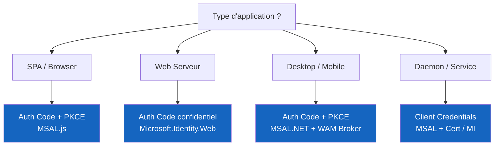

# IAM Reference — Azure / Entra ID

Base de connaissances personnelle sur l'Identity & Access Management, construite et enrichie au fil des projets terrain.

---

## Pourquoi ce site ?

Centraliser en un seul endroit consultable, cherchable et maintenable l'ensemble des connaissances IAM accumulées : protocoles OAuth2/OIDC, Entra ID, implémentation MSAL, monitoring KQL, gouvernance des identités, et roadmap des changements critiques Microsoft.

!!! tip "Comment naviguer"
    Utilisez les **onglets en haut** pour naviguer par domaine, ou la **barre de recherche** (`/` ou `S`) pour trouver instantanément n'importe quelle section.

---

## Structure du site

| Module | Contenu |
|---|---|
| [Fondamentaux IAM](fondamentaux/index.md) | Définitions, types d'identités, architecture Entra ID |
| [OAuth 2.0 & OIDC](oauth2/index.md) | Protocoles, flows, tokens, sécurité avancée (JAR, PAR, DPoP) |
| [Entra ID](entra-id/index.md) | App Registrations, CA, Token Protection, CAE, PIM, Managed Identities |
| [Implémentation MSAL](implementation/index.md) | Patterns de code par type d'application (SPA, desktop, daemon…) |
| [Monitoring & Audit](monitoring/index.md) | Logs, KQL, Sentinel, Identity Secure Score |
| [Identity Governance](gouvernance/index.md) | Entitlement Management, Access Reviews, Lifecycle Workflows |
| [Roadmap 2026](roadmap/index.md) | Breaking changes confirmés, dates à surveiller, plan d'action |

---

## Références rapides

=== "Codes AADSTS fréquents"

    | Code | Cause |
    |---|---|
    | AADSTS50076 | MFA requise |
    | AADSTS50079 | MFA forcée (changement d'état sécurité) |
    | AADSTS50105 | Utilisateur non assigné à l'application |
    | AADSTS65001 | Consentement non accordé pour les scopes demandés |
    | AADSTS700016 | Application introuvable dans le tenant |
    | AADSTS7000215 | Client secret invalide |

=== "Durées de vie des tokens"

    | Token | Durée par défaut |
    |---|---|
    | Access Token | 1 heure |
    | Refresh Token (multi-session) | 90 jours glissants |
    | PRT | 14 jours (renouvelé à l'usage) |
    | CAE Access Token | Jusqu'à 24-28h |

=== "Endpoints Entra ID"

    ```
    Authorization  https://login.microsoftonline.com/{tenant}/oauth2/v2.0/authorize
    Token          https://login.microsoftonline.com/{tenant}/oauth2/v2.0/token
    JWKS           https://login.microsoftonline.com/{tenant}/discovery/v2.0/keys
    OpenID Config  https://login.microsoftonline.com/{tenant}/v2.0/.well-known/openid-configuration
    Device Code    https://login.microsoftonline.com/{tenant}/oauth2/v2.0/devicecode
    ```

---

## Arbre de décision rapide — Quel flow OAuth2 ?



---

*Dernière mise à jour : juin 2026*
