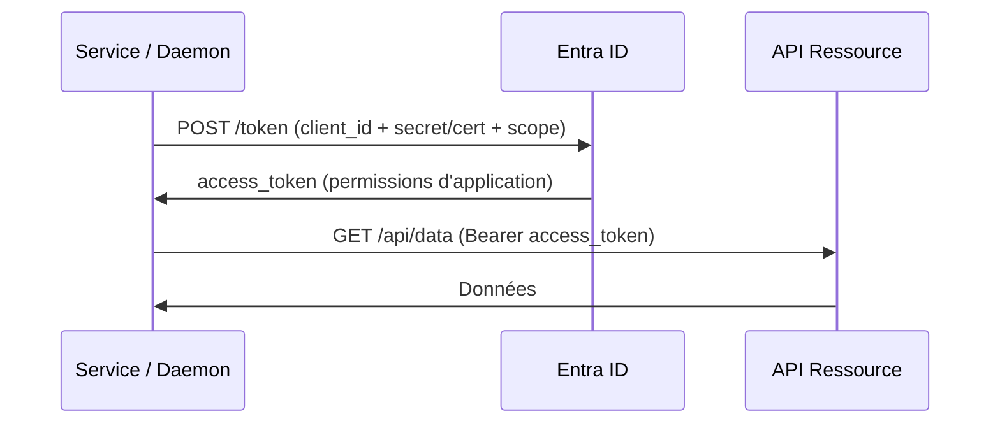

# Flows machine-to-machine

Flows sans interaction utilisateur — le service s'authentifie avec sa propre identité.

---

## Client Credentials Flow

Flow standard pour les **daemons, services, et pipelines CI/CD**.



### Avec un secret (déconseillé en prod)

```
POST https://login.microsoftonline.com/{tenant}/oauth2/v2.0/token

grant_type=client_credentials
&client_id=CLIENT_ID
&client_secret=CLIENT_SECRET
&scope=https://graph.microsoft.com/.default
```

### Avec un certificat (recommandé)

```csharp
// MSAL.NET — Client Credentials avec certificat
var certificate = new X509Certificate2("cert.pfx", "password");

var app = ConfidentialClientApplicationBuilder
    .Create("CLIENT_ID")
    .WithCertificate(certificate)
    .WithAuthority("https://login.microsoftonline.com/TENANT_ID")
    .Build();

var result = await app
    .AcquireTokenForClient(new[] { "https://graph.microsoft.com/.default" })
    .ExecuteAsync();
```

!!! tip "Managed Identity — zéro credential à gérer"
    Si le service tourne sur Azure (VM, App Service, Function, AKS), préférer **Managed Identity** plutôt que Client Credentials. Pas de secret à stocker, pas de rotation, pas d'expiration.

---

## Managed Identity

```csharp
// Azure.Identity — DefaultAzureCredential
using Azure.Identity;
using Azure.Security.KeyVault.Secrets;

var credential = new DefaultAzureCredential();
var client = new SecretClient(
    new Uri("https://mon-keyvault.vault.azure.net/"),
    credential
);
```

### Chaîne d'authentification DefaultAzureCredential

| Priorité | Credential | Environnement |
|---|---|---|
| 1 | EnvironmentCredential | Variables d'env (CI/CD) |
| 2 | WorkloadIdentityCredential | AKS Workload Identity |
| 3 | ManagedIdentityCredential | Azure (VM, App Service, Function) |
| 4 | AzureCliCredential | Local (`az login`) |
| 5 | VisualStudioCodeCredential | Local (VS Code) |

!!! warning "En production"
    Ne pas utiliser `DefaultAzureCredential` en production — utiliser `ManagedIdentityCredential` explicitement pour éviter les tentatives inutiles et les erreurs silencieuses.

---

## On-Behalf-Of (OBO) Flow

Pour les **Web APIs qui doivent appeler d'autres APIs** au nom de l'utilisateur.

```
API A reçoit un access_token de l'utilisateur
→ Échange ce token contre un nouveau token pour API B
→ Appelle API B au nom de l'utilisateur (sans que l'utilisateur soit impliqué)
```

```csharp
// Microsoft.Identity.Web — OBO automatique
builder.Services.AddAuthentication(JwtBearerDefaults.AuthenticationScheme)
    .AddMicrosoftIdentityWebApi(builder.Configuration, "AzureAd")
    .EnableTokenAcquisitionToCallDownstreamApi()
    .AddMicrosoftGraph()
    .AddInMemoryTokenCaches();

// Dans le contrôleur
app.MapGet("/api/data", [Authorize] async (GraphServiceClient graph) => {
    var user = await graph.Me.GetAsync(); // OBO automatique
    return Results.Ok(user);
});
```

!!! info "Limite OBO"
    Le refresh token OBO est limité à **24 heures** (vs 90 jours pour le flow standard). Pour les processus longs, prévoir une ré-authentification périodique.
