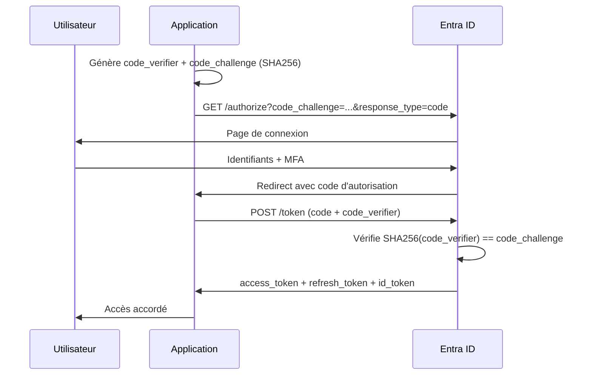
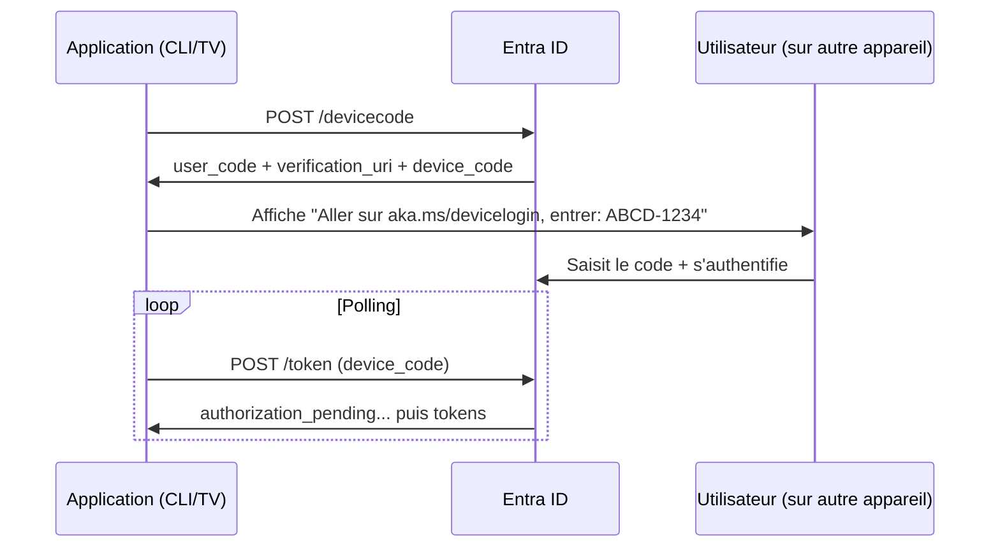

# Flows utilisateur

## Arbre de décision

```
Application avec utilisateur ?
├── Oui
│   ├── SPA (JavaScript dans le navigateur)  → Auth Code + PKCE  (MSAL.js)
│   ├── Web serveur (ASP.NET, Node.js)        → Auth Code confidentiel
│   ├── Desktop / Mobile                      → Auth Code + PKCE + Broker
│   └── Appareil sans navigateur (TV, IoT)    → Device Code Flow
└── Non (daemon, service)                     → Client Credentials
```

---

## Authorization Code Flow + PKCE

Flow recommandé pour **toutes les applications avec utilisateur**. PKCE (Proof Key for Code Exchange) est obligatoire pour les clients publics, fortement recommandé pour tous.



### Requête d'autorisation

```
GET https://login.microsoftonline.com/{tenant}/oauth2/v2.0/authorize
  ?client_id=CLIENT_ID
  &response_type=code
  &redirect_uri=https://monapp.com/callback
  &scope=openid profile User.Read
  &code_challenge=E9Melhoa2OwvFrEMTJguCHaoeK1t8URWbuGJSstw-cM
  &code_challenge_method=S256
  &state=xyz123
  &nonce=abc456
```

### Échange du code contre les tokens

```
POST https://login.microsoftonline.com/{tenant}/oauth2/v2.0/token

client_id=CLIENT_ID
&grant_type=authorization_code
&code=AUTHORIZATION_CODE
&redirect_uri=https://monapp.com/callback
&code_verifier=dBjftJeZ4CVP-mB92K27uhbUJU1p1r_wW1gFWFOEjXk
```

---

## Pourquoi PKCE remplace l'Implicit Flow

| | Implicit Flow | Auth Code + PKCE |
|---|---|---|
| **Statut** | Déprécié (RFC 9700) | Recommandé |
| **Token dans l'URL** | Oui (risque de fuite dans les logs) | Non |
| **Refresh Token** | Non disponible | Disponible |
| **Protection contre l'interception** | Aucune | PKCE |

!!! danger "Implicit Flow — ne plus utiliser"
    L'Implicit Flow retourne l'`access_token` directement dans l'URL de redirection (`#fragment`). Ce token peut être capturé par des scripts tiers, dans les logs serveur ou l'historique du navigateur. **MSAL.js v2+ a définitivement abandonné ce flow.**

---

## Device Code Flow

Pour les appareils sans navigateur ou les CLI.



```powershell
# Exemple Azure PowerShell / CLI
az login --use-device-code
# → Please go to https://microsoft.com/devicelogin and enter the code ABCD-1234
```
