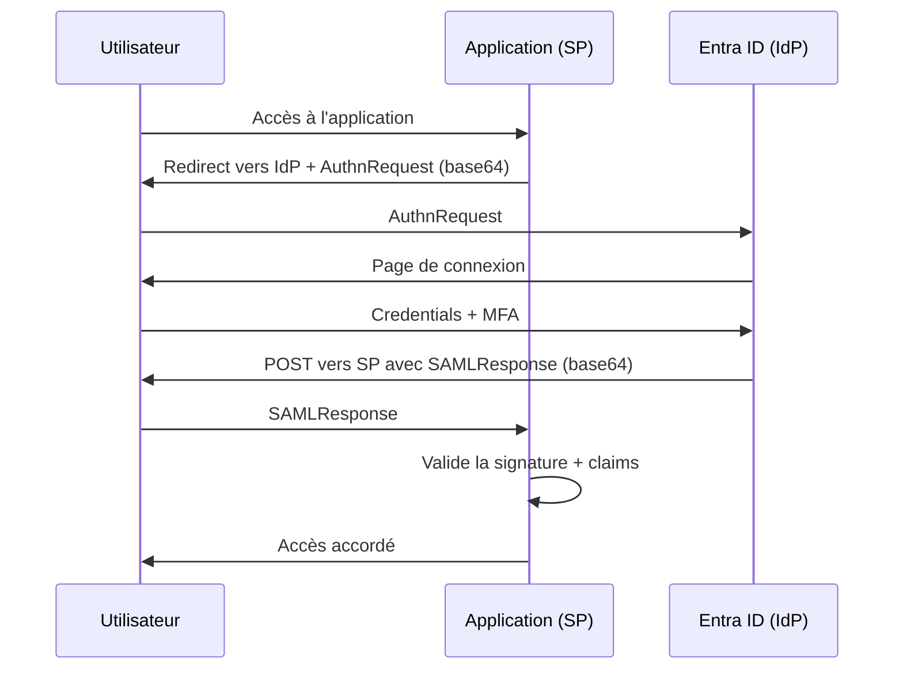

# SAML 2.0

Security Assertion Markup Language — protocole de SSO enterprise largement utilisé pour les applications SaaS.

---

## SAML vs OIDC vs OAuth2

| | SAML 2.0 | OIDC | OAuth2 |
|---|---|---|---|
| **Format du token** | XML (Assertion) | JWT (id_token) | JWT ou Opaque |
| **Transport** | HTTP redirect / POST | HTTP redirect | HTTP redirect + backchannel |
| **Usage principal** | SSO enterprise (SaaS) | Authentification moderne | Autorisation API |
| **Age** | 2005 | 2014 | 2012 |
| **Apps typiques** | Salesforce, ServiceNow, apps legacy | Azure, Microsoft 365, apps modernes | APIs REST |
| **Lien direct SP ↔ IdP** | Non — tout passe par le navigateur | Oui — backchannel pour le token | Oui — backchannel |

!!! info "Pourquoi SAML existe encore"
    SAML est antérieur au web moderne. Beaucoup d'applications SaaS d'entreprise (Salesforce, Workday, ServiceNow, iManage...) ont été conçues avec SAML et ne supportent pas encore OIDC. En 2026, les deux protocoles coexistent.

---

## Acteurs SAML

| Terme | Équivalent OAuth2 | Rôle |
|---|---|---|
| **IdP** (Identity Provider) | Authorization Server | Authentifie l'utilisateur, émet l'assertion |
| **SP** (Service Provider) | Client / Relying Party | L'application qui consomme l'assertion |
| **Assertion** | id_token | Le document XML signé qui prouve l'identité |
| **Subject** | sub claim | L'identifiant de l'utilisateur dans l'assertion |

---

## Flux SP-initiated (le plus courant)

L'utilisateur arrive sur l'application → l'app le redirige vers l'IdP.



**Point clé :** le SP et l'IdP ne se parlent **jamais directement** — tout transite par le navigateur de l'utilisateur via des redirections HTTP et des formulaires POST. C'est la différence fondamentale avec OIDC qui a un backchannel.

---

## Flux IdP-initiated

L'utilisateur est déjà connecté à l'IdP (ex: portail My Apps) et clique sur une application.

```
Portail My Apps (Entra ID)
    │
    │ L'utilisateur clique sur l'app
    ▼
IdP génère une assertion et POST directement vers le SP
    │
    ▼
SP valide et accorde l'accès — sans AuthnRequest préalable
```

!!! warning "IdP-initiated — risque de sécurité"
    Le flux IdP-initiated est vulnérable aux attaques CSRF car aucun AuthnRequest n'a été initié par le SP. Certaines apps refusent ce mode pour cette raison.

---

## Structure d'une assertion SAML

```xml
<saml:Assertion xmlns:saml="urn:oasis:names:tc:SAML:2.0:assertion"
    ID="_abc123"
    IssueInstant="2026-06-28T09:00:00Z"
    Version="2.0">

    <!-- Émetteur — l'IdP -->
    <saml:Issuer>https://sts.windows.net/TENANT_ID/</saml:Issuer>

    <!-- Signature numérique avec la clé privée de l'IdP -->
    <ds:Signature>...</ds:Signature>

    <!-- Subject — l'identité de l'utilisateur -->
    <saml:Subject>
        <saml:NameID Format="urn:oasis:names:tc:SAML:1.1:nameid-format:emailAddress">
            salah@dgfla.com
        </saml:NameID>
    </saml:Subject>

    <!-- Conditions de validité -->
    <saml:Conditions
        NotBefore="2026-06-28T09:00:00Z"
        NotOnOrAfter="2026-06-28T10:00:00Z">
        <saml:AudienceRestriction>
            <!-- Le SP pour lequel cette assertion est émise -->
            <saml:Audience>https://monapp.com/saml/metadata</saml:Audience>
        </saml:AudienceRestriction>
    </saml:Conditions>

    <!-- Attributs utilisateur -->
    <saml:AttributeStatement>
        <saml:Attribute Name="http://schemas.xmlsoap.org/ws/2005/05/identity/claims/emailaddress">
            <saml:AttributeValue>salah@dgfla.com</saml:AttributeValue>
        </saml:Attribute>
        <saml:Attribute Name="http://schemas.microsoft.com/ws/2008/06/identity/claims/groups">
            <saml:AttributeValue>DSI</saml:AttributeValue>
        </saml:Attribute>
    </saml:AttributeStatement>

</saml:Assertion>
```

---

## Configuration SSO SAML dans Entra ID

### Étapes

```
Portail Entra → Applications → Enterprise applications
→ New application → (galerie ou non-gallery)
→ Single sign-on → SAML
```

### Les 4 paramètres clés

| Paramètre | Description | Exemple |
|---|---|---|
| **Identifier (Entity ID)** | Identifiant unique du SP | `https://monapp.com/saml/metadata` |
| **Reply URL (ACS URL)** | URL où Entra poste l'assertion | `https://monapp.com/saml/callback` |
| **Sign on URL** | URL de démarrage (SP-initiated) | `https://monapp.com/login` |
| **NameID format** | Format de l'identifiant utilisateur | `emailAddress` ou `persistent` |

### Certificat de signature

```powershell
# Télécharger le certificat de signature Entra ID (à importer dans le SP)
# Portail Entra → Enterprise App → SSO SAML
# → SAML Signing Certificate → Download Certificate (Base64)

# Vérifier l'expiration du certificat
Get-MgServicePrincipalTokenSigningCertificate `
    -ServicePrincipalId $spId |
    Select-Object DisplayName, EndDateTime, Status
```

!!! danger "Certificat SAML — expiration critique"
    Le certificat de signature Entra ID expire tous les **3 ans**. À l'expiration, le SSO cesse de fonctionner immédiatement pour toutes les apps utilisant ce certificat. Surveiller l'expiration via l'Identity Secure Score ou une alerte Graph API.

---

## Attributs et claims SAML

Entra ID permet de mapper les attributs de l'utilisateur vers des claims SAML personnalisés.

```
Portail Entra → Enterprise App → SSO SAML
→ Attributes & Claims → Edit
```

| Claim | Source Entra ID | Usage SP |
|---|---|---|
| `emailaddress` | `user.mail` | Identifiant principal |
| `givenname` | `user.givenname` | Prénom |
| `surname` | `user.surname` | Nom |
| `groups` | Groupes de sécurité | Rôles dans l'application |
| `department` | `user.department` | Segmentation dans l'app |

```powershell
# Configurer un claim personnalisé via PowerShell
$claimsMappingPolicy = @{
    Definition = @('{
        "ClaimsMappingPolicy": {
            "Version": 1,
            "IncludeBasicClaimSet": true,
            "ClaimsSchema": [{
                "Source": "user",
                "ID": "department",
                "SamlClaimType": "http://schemas.xmlsoap.org/ws/2005/05/identity/claims/department"
            }]
        }
    }')
    DisplayName = "SAML Custom Claims"
    IsOrganizationDefault = $false
}
New-MgPolicyClaimMappingPolicy -BodyParameter $claimsMappingPolicy
```

---

## Validation de l'assertion côté SP

Ce que le SP doit vérifier à la réception de l'assertion :

| Vérification | Pourquoi |
|---|---|
| **Signature XML** | Vérifier que l'assertion vient bien de l'IdP de confiance |
| **Audience** | L'assertion est bien destinée à ce SP |
| **NotBefore / NotOnOrAfter** | L'assertion n'est pas expirée |
| **InResponseTo** | Correspond à l'AuthnRequest initial (anti-replay) |
| **NameID** | Identifier l'utilisateur |

---

## Dépannage SSO SAML

### Outil de diagnostic

```
Portail Entra → Enterprise App → SSO SAML → Test
→ Tester en tant qu'utilisateur courant ou autre utilisateur
```

### KQL — Erreurs SAML dans les Sign-in Logs

```kql
SigninLogs
| where TimeGenerated > ago(7d)
| where AuthenticationProtocol == "SAML20"
| where ResultType != "0"
| project TimeGenerated, UserPrincipalName, AppDisplayName,
          ResultType, ResultDescription, IPAddress
| order by TimeGenerated desc
```

### Erreurs fréquentes

| Erreur | Cause probable | Solution |
|---|---|---|
| `AADSTS750054` | SAMLRequest absent ou invalide | Vérifier l'Entity ID et l'ACS URL dans Entra |
| `AADSTS7500529` | Certificat de signature expiré | Renouveler le certificat dans Entra + importer dans le SP |
| `AADSTS50107` | Realm fédéré introuvable | Vérifier la configuration du domaine |
| Audience mismatch | Entity ID ne correspond pas | Aligner l'Entity ID entre Entra et le SP |
| Replay attack | Assertion déjà utilisée | Vérifier l'horloge du serveur SP (NTP) |

---

## SAML vs OIDC — Quand choisir ?

| Critère | SAML | OIDC |
|---|---|---|
| Application SaaS legacy | Souvent requis | Rarement supporté |
| Application moderne | Possible mais lourd | Recommandé |
| Mobile / SPA | Non adapté | Natif |
| Pas de backchannel réseau SP↔IdP | Oui — tout via navigateur | Non — backchannel nécessaire |
| Taille du token | Verbose (XML) | Compact (JWT) |
| Ecosystème Microsoft 365 | Supporté | Préféré |
